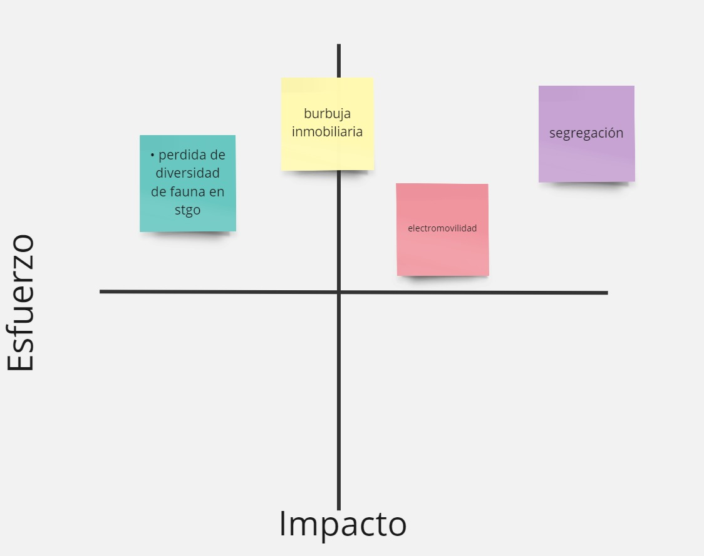

# Tarea 01 - Aline Bergen

### 1. **Electro movilidad en Chile**

#### **Pros:**

- **Relevancia Actual:** Es un tema de alta actualidad, especialmente con las políticas gubernamentales y el interés por reducir la huella de carbono. 

- **Innovación:** Es un tema que está en crecimiento, por lo que hay bastante material reciente y novedoso. 

#### **Contras:** 

- **Accesibilidad Limitada:** La electromovilidad presenta una accesibilidad limitada, ya que no todos pueden adquirir vehículos eléctricos, lo que podría hacer que la audiencia se sienta menos identificada con el tema. Además, su impacto está concentrado en áreas urbanas y en ciertos estratos sociales, lo que restringe su alcance y no abarca a toda la población.  

- **Falta de Cobertura:** Podría ser un desafío encontrar datos específicos y suficientes para realizar un análisis profundo y completo y esto dificulta a encontrar y acceder a datos.

### 2. **Burbuja Inmobiliaria en una Comuna Específica de la Capital**

#### **Pros:**

- **Impacto Social:** El tema tiene un alto impacto, especialmente para las generaciones jóvenes que ven difícil la posibilidad de adquirir una vivienda propia. 
 

- **Enfoque Local:** Enfocarse en una comuna específica puede hacer que el análisis sea más detallado y relevante para la audiencia local. 

#### **Contras:**

- **Complejidad:** Requiere un análisis profundo y puede ser necesario consultar muchos estudios técnicos y proyectos futuros. 

- **Extensión del Trabajo:** Si se enfocan solo en una comuna, puede ser limitante, pero expandir el tema a más áreas puede hacerlo demasiado extenso.

### 3. **Pérdida de Diversidad de Fauna en Santiago**

#### **Pros:**

- **Conciencia Ambiental:** Es un tema que puede atraer a una audiencia interesada en la conservación y el medio ambiente. 

- **Narrativa Visual:** Este tema ofrece grandes oportunidades para contar historias visuales impactantes y emotivas. 

#### **Contras:**

- **Limitación de Datos:** Los datos sobre la fauna específica de un sector (ejemplo: del río Mapocho) y su degradación pueden ser limitados o difíciles de obtener. 

### 4. **Segregación Urbana basada en Áreas Verdes**

#### **Pros:**

- **Relevancia Social:** La segregación urbana es un tema de gran relevancia, especialmente en relación con la calidad de vida y la justicia social. 

- **Datos Claros:** Es probable que existan estudios y datos disponibles sobre la distribución de áreas verdes en las comunas de Santiago. 

#### **Contras:**

- **Complejidad del Análisis:** Requiere un enfoque multidisciplinario que combine urbanismo, sociología, y geografía. 

- **Enfoque Limitado:** Va a depender en qué área nos queremos enfocar (educación, economía, urbanismo, etc.) Si solo se centran en áreas verdes, pueden perder otras facetas importantes de la segregación urbana. 

## Matriz impacto x esfuerzo

## CONCLUSIONES DEL MIRO 

### Basándonos en el gráfico de impacto y esfuerzo en el tablero de Miro: 

1. **_Segregación Urbana:_** Es un tema de gran relevancia y alto impacto, pero requiere un esfuerzo significativo en términos de investigación, lo que podría resultar en un contenido muy poderoso.
  

2. **_Burbuja Inmobiliaria:_**  Representa un equilibrio adecuado entre impacto y esfuerzo, siendo una opción viable y pertinente, especialmente para la generación joven.

  
3. **_Pérdida de Diversidad de Fauna:_** Tiene un impacto menor, pero demanda menos esfuerzo, ideal si se busca un enfoque ambiental que no sea tan complejo.

  
4. **_Electromovilidad:_** Aunque tiene posibilidades, su impacto es limitado y requiere un esfuerzo considerable, lo que podría afectar su efectividad como tema central. 

  

